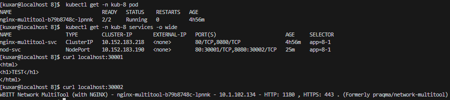
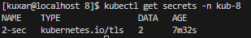

# kuber-08-conf-app
Домашнее задание к занятию «Конфигурация приложений»

### Задание 1. 
```
 kubectl create namespace kub-8
```
 Создаю сервис для доступа к подам с локальной машинки
```
 kubectl apply -n kub-8 -f [1-srv.yaml](yaml/1-srv.yaml) 
```
 Подготавливаю конф.мап, в нем учтена информация о необходимости смены порта у мультитула из за занятости порта у nginx, также добелена переемная создания тестовой веб страницы.
```
 kubectl apply -n kub-8 -f [1-confmap.yaml](yaml/1-confmap.yaml)
```
```
 kubectl apply -n kub-8 -f [1-dep.yaml](yaml/1-dep.yaml)
```
 Дополнительно сделал NodePort для доступа с локального компа
```
 kubectl apply -n kub-8 -f [1-nodsrv.yaml](yaml/1-nodsrv.yaml) 
```
 Все работает исправно 

 

 Манифесты:

 [1-confmap.yaml](yaml/1-confmap.yaml)

 [1-dep.yaml](yaml/1-dep.yaml)

 [1-srv.yaml](yaml/1-srv.yaml)

 [1-nodsrv.yaml](yaml/1-nodsrv.yaml)

 ### Задание 2. 

openssl req -x509 -nodes -days 9999 -newkey rsa:2048 -keyout cert/ing.key -out cert/ing.crt

kubectl create secret tls 2-sec --namespace kub-8 --key=cert/ing.key --cert=cert/ing.crt -o yaml

kubectl get secrets -n kub-8



kubectl apply -n kub-8 -f 2-ser.yaml

kubectl apply -n kub-8 -f 2-confmap.yaml

kubectl apply -n kub-8 -f 2-ing.yaml 

kubectl apply -n kub-8 -f 2-dep.yaml